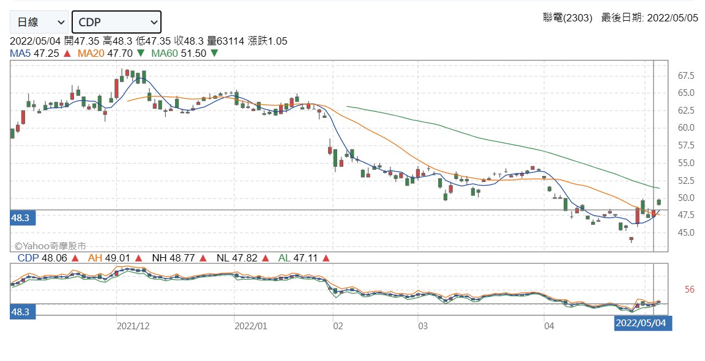

# Stock Tool 2

## Description

利用python撰寫API提供個股資訊，回傳以下資訊：

* KDJ
* MACD
* RSI
* 乖離率(BIAS)
* 威廉指標(WR)
* 多堂指標乖離(BBI)
* CDP
* DMI


> 以下以2303聯電做查詢結果比對

### KDJ


可以看到5/4的`K9`，`D9`，`3K-2D`，`RSV`與YAHOO股市相同

### MACD


可以看到5/4的`MACD`，`DIF9`，`EMA12`，`EMA26`與YAHOO股市相同

### RSI


可以看到5/4的`RSI5`，`RSI10`與YAHOO股市相同

### BIAS


可以看到5/4的`BIAS10`，`BIAS20`，`B10-B20`與YAHOO股市相同

### WR


可以看到5/4的`W%R9`與YAHOO股市相同

### BBI


可以看到5/4的`M3`與YAHOO股市相同。

而至於`BS`，我所採用的公式為`BS: (MA(C,3)+MA(C,6)+MA(C,12)+MA(C,24))/4`，屬於較多人在使用的，但數值上似乎與YAHOO股市不同，可能是YAHOO股市採用的公式不同導致。

[REF1](https://www.members.tripod.com/tayu/fashion2-19.htm)
[REF2](http://www.chiefox.com.tw/bbs/showthread.php?threadid=11971)

### CDP



可以看到5/4的`CDP`，`AH`，`NH`，`NL`，`AL`與YAHOO股市相同。

### DMI


而`+DI`，`-DI`，`ADX`，`ACXR`似乎都與YAHOO股市不同，因此在此說明我所採用的公式：

* DM

    ```plain
    +DM = 本日最高價 - 昨日最高價
    -DM = 本日最低價 - 昨日最低價
    ```

* TR

    ```plain
    以當前最高價、當前最低價及前一日收盤價，三種價格來做差值比較，取當日股價變動的最大值作為計算基礎。
    ```

* ATR

    ```plain
    移動平均後的TR值，代表+ DM和-DM14個週期的值加總後的平均值
    ```

* DI

    ```plain
    +DI = + DI N日平均 / TR N日平均
    -DI = - DI N日平均 / TR N日平均
    ```

* DX

    ```plain
    DX：將「+DI值扣除-D值的絕對值」除以「+DI值加上-D值的絕對值」，再乘以100。
    ```

* ADX

    ```plain
    DX的移動平均值，至少計算14個週期後，將14個週期的DX值移動平均後得到ADX。
    ```

* ADXR

    ```plain
    當前ADX值和前14個週期的ADX值做簡單移動平均計算後得出。
    ```

[參考出處](https://python.plainenglish.io/trading-using-python-average-directional-index-adx-aeab999cffe7)
[參考出處2](https://augustime.com/directional-movement-index/)

## Usage

`getStock()`

參數

* `stockNo`：`int`，個股代號。
* `start_date`：`str`，查詢區間的起始時間，格式須為`YYYYMMDD`，預設為180天之前。
* `end_date`：`str`，查詢區間的結束時間，格式須為`YYYYMMDD`，預設為當前日期。
* `period`：`str`，指定使用日線(`'D'`)、周線(`'W'`)、月線(`'M'`)，預設使用日線。

Example

```python
import stock as stock
import json

response = stock.getStock(2303, period='D')

# print(json.dumps(response, indent=4, sort_keys=True))
with open("2303.json", 'w', encoding='utf8') as f:
    json.dump(response, f, indent=4, sort_keys=False, ensure_ascii=False)
```

Output

* `stockNo`：個股代號。
* `stockName`：個股名稱。
* `start_date`：查詢區間的起始時間(股市)
* `end_date`：查詢區間的結束時間(股市)
* `date`：至起始時間到結束時間的資料，以日期作為index

```JSON
{
    "stockNo": 2303,
    "stockName": "聯電",
    "start_date": "20211108",
    "end_date": "20220504",
    "data": {
        "20211108": {
            ...
        },
        "20211109": {
            ...
        },
        ...
        "20220504": {
            "shdid": 24169917,
            "capacity": 63296856,
            "turnover": 3022859966,
            "high": 48.3,
            "low": 47.35,
            "close": 48.3,
            "change": 1.05,
            "transaction_volume": 21677,
            "open": 47.35,
            "MA_5": 47.25,
            "MA_10": 47.085,
            "MA_20": 47.705,
            "MA_60": 51.505,
            "RSV": 74.8031496063,
            "K": 61.0600826779,
            "D": 48.9120236611,
            "3K-2D": 85.3562007114,
            "DIF": -2.3252546756,
            "DEA": -2.4010392,
            "MACD": 0.1515690488,
            "RSI": 59.5722604983,
            "BIAS_5": 2.2222222222,
            "BIAS_10": 2.5804396305,
            "BIAS_20": 1.2472487161,
            "WR": -25.1968503937,
            "BBI": 47.61875,
            "CDP": 48.0625,
            "AN": 49.0125,
            "NH": 48.775,
            "AL": 47.1125,
            "NL": 47.825,
            "TR": 20.95,
            "HD": -0.2,
            "LD": -0.25,
            "DMP": 0.525,
            "DMM": 0.4785714286,
            "PDI": 2.5059665871,
            "MDI": 2.2843504944,
            "ADX": 45.7532410704,
            "ADXR": 36.285769942
        }
    }
}

```
